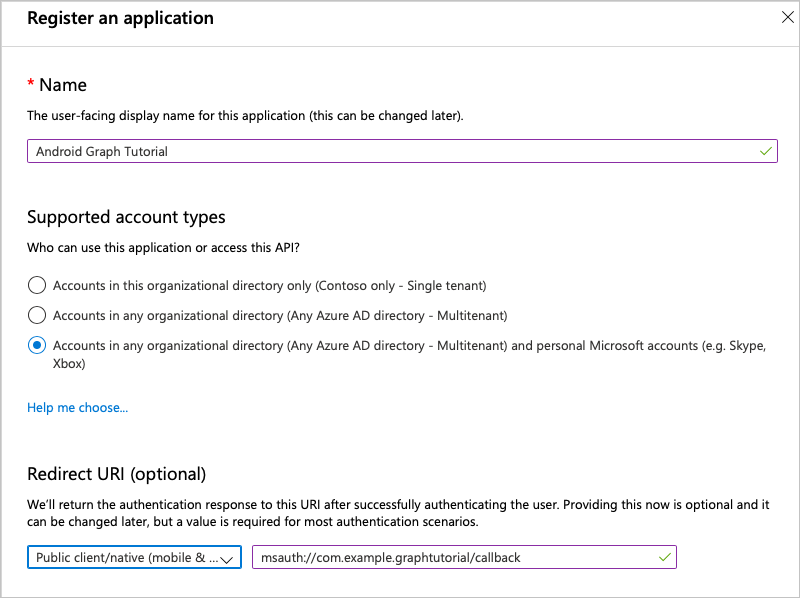

# Como executar o projeto concluídoHow to run the completed project

## Pré-requisitosPrerequisites

Para executar o projeto concluído nessa pasta, você precisará do seguinte:To run the completed project in this folder, you need the following:

- [Android Studio](https://developer.android.com/studio/) instalado em sua máquina de desenvolvimento.[Android Studio](https://developer.android.com/studio/) installed on your development machine. (**Observação:** este tutorial foi escrito com o Android Studio versão 3.3.1 com o 1.8.0 jre e o SDK 9,0 do Android.(**Note:** This tutorial was written with Android Studio version 3.3.1 with the 1.8.0 JRE and the Android 9.0 SDK. As etapas deste guia podem funcionar com outras versões, mas que não foram testadas.The steps in this guide may work with other versions, but that has not been tested.)
- Uma conta pessoal da Microsoft com uma caixa de correio no Outlook.com ou uma conta corporativa ou de estudante da Microsoft.Either a personal Microsoft account with a mailbox on Outlook.com, or a Microsoft work or school account.

Se você não tem uma conta da Microsoft, há algumas opções para obter uma conta gratuita:If you don't have a Microsoft account, there are a couple of options to get a free account:

- Você pode [se inscrever para uma nova conta pessoal da Microsoft](https://signup.live.com/signup?wa=wsignin1.0&rpsnv=12&ct=1454618383&rver=6.4.6456.0&wp=MBI_SSL_SHARED&wreply=https://mail.live.com/default.aspx&id=64855&cbcxt=mai&bk=1454618383&uiflavor=web&uaid=b213a65b4fdc484382b6622b3ecaa547&mkt=E-US&lc=1033&lic=1).You can [sign up for a new personal Microsoft account](https://signup.live.com/signup?wa=wsignin1.0&rpsnv=12&ct=1454618383&rver=6.4.6456.0&wp=MBI_SSL_SHARED&wreply=https://mail.live.com/default.aspx&id=64855&cbcxt=mai&bk=1454618383&uiflavor=web&uaid=b213a65b4fdc484382b6622b3ecaa547&mkt=E-US&lc=1033&lic=1).
- Você pode [se inscrever no programa para desenvolvedores do office 365](https://developer.microsoft.com/office/dev-program) para obter uma assinatura gratuita do Office 365.You can [sign up for the Office 365 Developer Program](https://developer.microsoft.com/office/dev-program) to get a free Office 365 subscription.

## Registrar um aplicativo com o portal do AzureRegister an application with the Azure Portal

1. Abra um navegador, navegue até o [centro de administração do Azure Active Directory](https://aad.portal.azure.com) e faça logon usando uma **conta pessoal** (também conhecida como conta da Microsoft) ou **Conta Corporativa ou de Estudante**.Open a browser and navigate to the [Azure Active Directory admin center](https://aad.portal.azure.com) and login using a **personal account** (aka: Microsoft Account) or **Work or School Account**.

1. Selecione **Azure Active Directory** na navegação à esquerda e, em seguida, selecione **registros de aplicativo** em **gerenciar**.Select **Azure Active Directory** in the left-hand navigation, then select **App registrations** under **Manage**.

    

1. Selecione **Novo registro**.Select **New registration**. Na página **Registrar um aplicativo**, defina os valores da seguinte forma.On the **Register an application** page, set the values as follows.

    - Defina **Nome** para `Android Graph Tutorial`.Set **Name** to `Android Graph Tutorial`.
    - Defina **Tipos de conta com suporte** para **Contas em qualquer diretório organizacional e contas pessoais da Microsoft**.Set **Supported account types** to **Accounts in any organizational directory and personal Microsoft accounts**.
    - Deixe o **URI de Redirecionamento** vazio.Leave **Redirect URI** empty.

    

1. Escolha **Registrar**.Choose **Register**. Na página **tutorial do gráfico do Xamarin** , copie o valor da **ID do aplicativo (cliente)** e salve-o, você precisará dele na próxima etapa.On the **Xamarin Graph Tutorial** page, copy the value of the **Application (client) ID** and save it, you will need it in the next step.

    

1. Selecione o link **Adicionar um URI** de redirecionamento.Select the **Add a Redirect URI** link. Na página **redirecionar URIs** , localize a seção redirecionar **URIs sugeridos para clientes públicos (móvel, área de trabalho)** .On the **Redirect URIs** page, locate the **Suggested Redirect URIs for public clients (mobile, desktop)** section. Selecione o URI que começa com `msal` e copie-o e, em seguida, escolha **salvar**.Select the URI that begins with `msal` and copy it, then choose **Save**. Salve o URI de redirecionamento copiado, será necessário na próxima etapa.Save the copied redirect URI, you will need it in the next step.

    

## Executar o exemploRun the sample

No Android Studio, escolha **executar "aplicativo"** no menu **executar** .In Android Studio, choose **Run 'app'** on the **Run** menu.