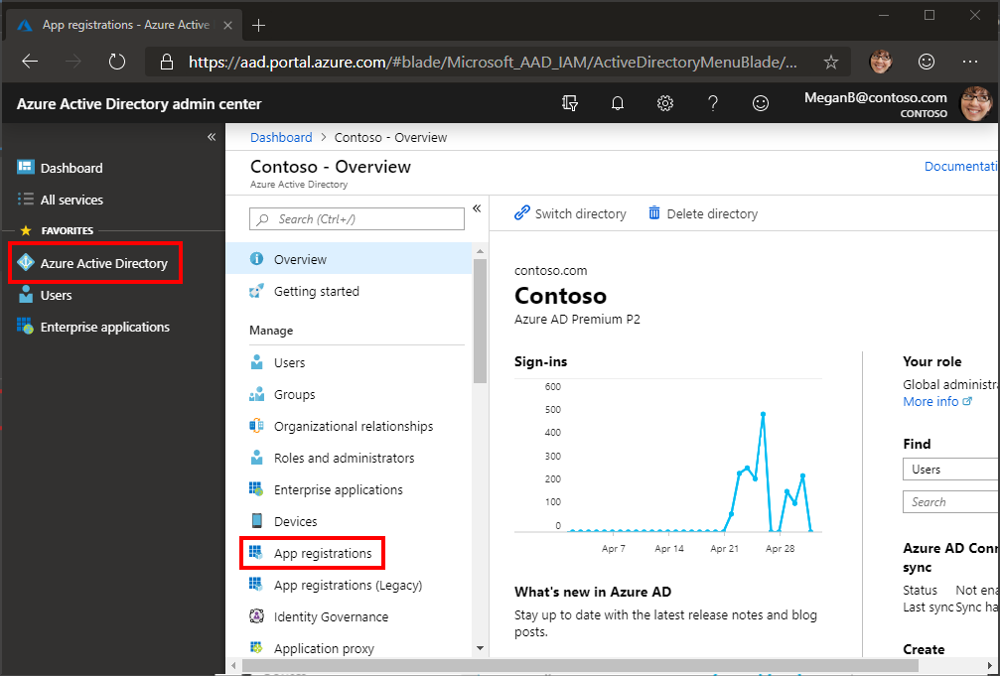

# Como executar o projeto concluído

## Pré-requisitos

Para executar o projeto concluído nessa pasta, você precisará do seguinte:

- [Android Studio](https://developer.android.com/studio/) instalado em sua máquina de desenvolvimento. (**Observação:** este tutorial foi escrito com o Android Studio versão 3.3.1 com o 1.8.0 jre e o SDK 9,0 do Android. As etapas deste guia podem funcionar com outras versões, mas que não foram testadas.
- Uma conta pessoal da Microsoft com uma caixa de correio no Outlook.com ou uma conta corporativa ou de estudante da Microsoft.

Se você não tem uma conta da Microsoft, há algumas opções para obter uma conta gratuita:

- Você pode [se inscrever para uma nova conta pessoal da Microsoft](https://signup.live.com/signup?wa=wsignin1.0&rpsnv=12&ct=1454618383&rver=6.4.6456.0&wp=MBI_SSL_SHARED&wreply=https://mail.live.com/default.aspx&id=64855&cbcxt=mai&bk=1454618383&uiflavor=web&uaid=b213a65b4fdc484382b6622b3ecaa547&mkt=E-US&lc=1033&lic=1).
- Você pode [se inscrever no programa para desenvolvedores do office 365](https://developer.microsoft.com/office/dev-program) para obter uma assinatura gratuita do Office 365.

## Registrar um aplicativo com o portal do Azure

1. Abra um navegador, navegue até o [centro de administração do Azure Active Directory](https://aad.portal.azure.com) e faça logon usando uma **conta pessoal** (também conhecida como conta da Microsoft) ou **Conta Corporativa ou de Estudante**.

1. Selecione **Azure Active Directory** na navegação à esquerda e, em seguida, selecione **Registros do aplicativo (Visualizar)** sob **Gerenciar**.

    

1. Selecione **Novo registro**. Na página **Registrar um aplicativo**, defina os valores da seguinte forma.

    - Defina **Nome** para `Android Graph Tutorial`.
    - Defina **Tipos de conta com suporte** para **Contas em qualquer diretório organizacional e contas pessoais da Microsoft**.
    - Deixe o **URI de Redirecionamento** vazio.

    

1. Escolha **Registrar**. Na página **tutorial do gráfico do Xamarin** , copie o valor da **ID do aplicativo (cliente)** e salve-o, você precisará dele na próxima etapa.

    

1. Selecione o link **Adicionar um URI** de redirecionamento. Na página **redirecionar URIs** , localize a seção reDirecionar **URIs sugeridos para clientes públicos (móvel, área de trabalho)** . Selecione o URI que começa com `msal` e copie-o e, em seguida, escolha **salvar**. Salve o URI de redirecionamento copiado, será necessário na próxima etapa.

    

## Executar o exemplo

No Android Studio, escolha **executar "aplicativo"** no menu **executar** .