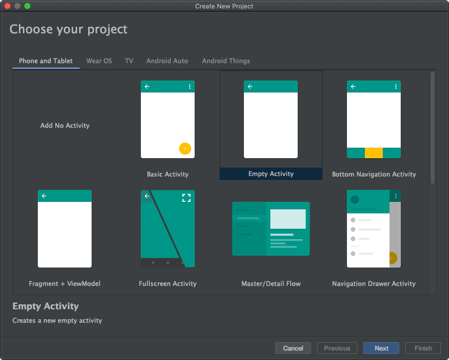
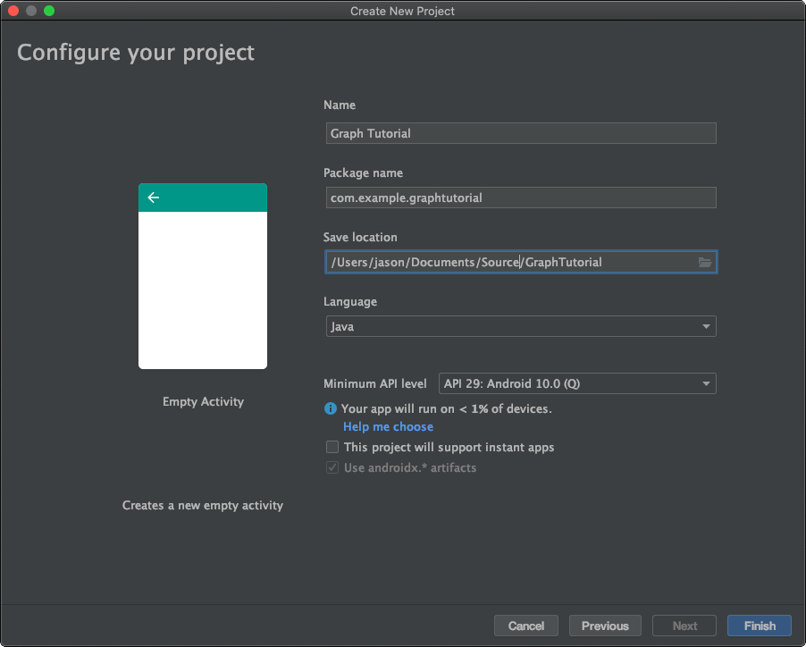
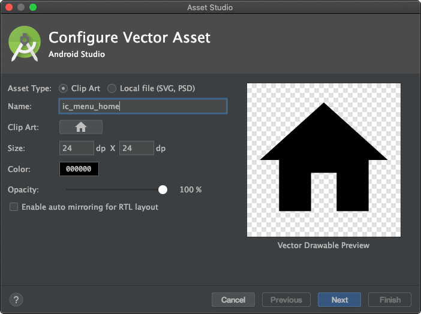
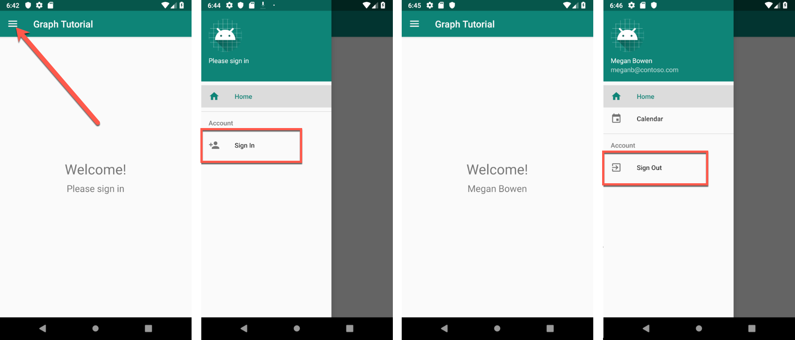

<!-- markdownlint-disable MD002 MD041 -->

Comece criando um novo projeto do Android Studio.

1. Abra Android Studio e selecione **Iniciar um novo projeto do Android Studio** na tela de boas-vindas.

1. Na caixa de diálogo **criar novo projeto** , selecione **atividade vazia**e, em seguida, selecione **Avançar**.

    

1. Na caixa de diálogo **Configurar o projeto** , defina **** o nome `Graph Tutorial`como, verifique se o campo de idioma `Java`está definido como e se o nível de **API mínimo** está definido como. **** `API 27: Android 8.1 (Oreo)` Modifique o **nome do pacote** e **salve o local** conforme necessário. Selecione **Concluir**.

    

> [!IMPORTANT]
> Certifique-se de inserir exatamente o mesmo nome para o projeto especificado nas instruções do laboratório. O nome do projeto se torna parte do namespace no código. O código dentro dessas instruções depende do namespace correspondente ao nome do projeto especificado nessas instruções. Se você usar um nome de projeto diferente, o código não será compilado, a menos que você ajuste todos os namespaces para corresponder ao nome do projeto que você inseriu ao criar o projeto.

## <a name="install-dependencies"></a>Instalar dependências

Antes de prosseguir, instale algumas dependências adicionais que serão usadas posteriormente.

- `com.android.support:design`disponibilizar os layouts de gaveta de navegação para o aplicativo.
- A [biblioteca de autenticação da Microsoft (MSAL) para Android](https://github.com/AzureAD/microsoft-authentication-library-for-android) para lidar com a autenticação do Azure AD e o gerenciamento de tokens.
- [SDK do Microsoft Graph para Java](https://github.com/microsoftgraph/msgraph-sdk-java) para fazer chamadas para o Microsoft Graph.

1. Expanda **scripts do gradle**e, em seguida, abra o arquivo **Build. gradle (módulo: app)** .

1. Adicione as seguintes linhas dentro do `dependencies` valor.

    ```Gradle
    implementation 'com.android.support:design:28.0.0'
    implementation 'com.microsoft.graph:microsoft-graph:1.4.0'
    implementation 'com.microsoft.identity.client:msal:0.2.2'
    ```

    > [!NOTE]
    > Se você estiver usando uma versão diferente do SDK, certifique-se de `28.0.0` alterar o para corresponder à versão `com.android.support:appcompat-v7` da dependência já presente em **Build. gradle**.

1. Adicione um `packagingOptions` dentro do `android` valor no arquivo **Build. gradle (Module: app)** .

    ```Gradle
    packagingOptions {
        pickFirst 'META-INF/jersey-module-version'
    }
    ```

1. Salve suas alterações. No menu **arquivo** , selecione **sincronizar projeto com arquivos do gradle**.

## <a name="design-the-app"></a>Projetar o aplicativo

O aplicativo usará uma [gaveta de navegação](https://developer.android.com/training/implementing-navigation/nav-drawer) para navegar entre diferentes modos de exibição. Nesta etapa, você atualizará a atividade para usar um layout de gaveta de navegação e adicionará fragmentos para os modos de exibição.

### <a name="create-a-navigation-drawer"></a>Criar uma gaveta de navegação

Nesta seção, você criará ícones para o menu de navegação do aplicativo, criará um menu para o aplicativo e atualizará o tema e o layout do aplicativo para serem compatíveis com uma gaveta de navegação.

#### <a name="create-icons"></a>Criar ícones

1. Clique com o botão direito do mouse na pasta **app/res/Drawable** e selecione **novo**e, em seguida, **ativo vetorial**.

1. Clique no botão de ícone ao lado de **Clip-Art**.

1. Na janela **selecionar ícone** , digite `home` na barra de pesquisa e, em seguida, selecione o ícone **página inicial** e clique em **OK**.

1. Altere o **nome** para `ic_menu_home`.

    

1. Escolha **Avançar**e **concluir**.

1. Repita a etapa anterior para criar mais três ícones.

    - Nome: `ic_menu_calendar`, ícone:`event`
    - Nome: `ic_menu_signout`, ícone:`exit to app`
    - Nome: `ic_menu_signin`, ícone:`person add`

#### <a name="create-the-menu"></a>Criar o menu

1. Clique com o botão direito do mouse na pasta **res** e selecione **novo**e, em seguida, **diretório de recursos do Android**.

1. Altere o **tipo** de recurso `menu` para e selecione **OK**.

1. Clique com o botão direito do mouse na nova pasta de **menu** e selecione **novo**e, em seguida, **arquivo de recurso de menu**.

1. Nomeie o arquivo `drawer_menu` e selecione **OK**.

1. Quando o arquivo for aberto, selecione a guia **texto** para exibir o XML e substitua todo o conteúdo pelo seguinte.

    ```xml
    <?xml version="1.0" encoding="utf-8"?>
    <menu xmlns:android="http://schemas.android.com/apk/res/android"
        xmlns:tools="http://schemas.android.com/tools"
        tools:showIn="navigation_view">

        <group android:checkableBehavior="single">
            <item
                android:id="@+id/nav_home"
                android:icon="@drawable/ic_menu_home"
                android:title="Home" />

            <item
                android:id="@+id/nav_calendar"
                android:icon="@drawable/ic_menu_calendar"
                android:title="Calendar" />
        </group>

        <item android:title="Account">
            <menu>
                <item
                    android:id="@+id/nav_signin"
                    android:icon="@drawable/ic_menu_signin"
                    android:title="Sign In" />

                <item
                    android:id="@+id/nav_signout"
                    android:icon="@drawable/ic_menu_signout"
                    android:title="Sign Out" />
            </menu>
        </item>

    </menu>
    ```

#### <a name="update-application-theme-and-layout"></a>Atualizar tema e layout do aplicativo

1. Abra o arquivo **app/res/Values/Styles. xml** e substitua `Theme.AppCompat.Light.DarkActionBar` por `Theme.AppCompat.Light.NoActionBar`.

1. Adicione as seguintes linhas dentro do `style` elemento.

    ```xml
    <item name="windowActionBar">false</item>
    <item name="windowNoTitle">true</item>
    <item name="android:statusBarColor">@android:color/transparent</item>
    ```

1. Clique com o botão direito do mouse na pasta **app/res/layout** .

1. Selecione **novo**e, em seguida, **arquivo de recurso de layout**.

1. Nomeie o arquivo `nav_header` e altere o **elemento raiz** para `LinearLayout`e, em seguida, selecione **OK**.

1. Abra o arquivo **nav_header. xml** e selecione a guia **texto** . Substitua todo o conteúdo pelo seguinte.

    ```xml
    <?xml version="1.0" encoding="utf-8"?>
    <LinearLayout xmlns:android="http://schemas.android.com/apk/res/android"
        android:layout_width="match_parent"
        android:layout_height="176dp"
        android:background="@color/colorPrimary"
        android:gravity="bottom"
        android:orientation="vertical"
        android:padding="16dp"
        android:theme="@style/ThemeOverlay.AppCompat.Dark">

        <ImageView
            android:id="@+id/user_profile_pic"
            android:layout_width="wrap_content"
            android:layout_height="wrap_content"
            android:src="@mipmap/ic_launcher" />

        <TextView
            android:id="@+id/user_name"
            android:layout_width="wrap_content"
            android:layout_height="wrap_content"
            android:paddingTop="8dp"
            android:text="Test User"
            android:textAppearance="@style/TextAppearance.AppCompat.Body1" />

        <TextView
            android:id="@+id/user_email"
            android:layout_width="wrap_content"
            android:layout_height="wrap_content"
            android:text="test@contoso.com" />

    </LinearLayout>
    ```

1. Abra o arquivo **app/res/layout/activity_main. xml** e atualize o layout para um `DrawerLayout` substituindo o XML existente pelo seguinte.

    ```xml
    <?xml version="1.0" encoding="utf-8"?>
    <android.support.v4.widget.DrawerLayout xmlns:android="http://schemas.android.com/apk/res/android"
        xmlns:app="http://schemas.android.com/apk/res-auto"
        xmlns:tools="http://schemas.android.com/tools"
        android:id="@+id/drawer_layout"
        android:layout_width="match_parent"
        android:layout_height="match_parent"
        android:fitsSystemWindows="true"
        tools:context=".MainActivity"
        tools:openDrawer="start">

        <RelativeLayout
            android:layout_width="match_parent"
            android:layout_height="match_parent"
            android:orientation="vertical">

            <ProgressBar
                android:id="@+id/progressbar"
                android:layout_width="75dp"
                android:layout_height="75dp"
                android:layout_centerInParent="true"
                android:visibility="gone"/>

            <android.support.v7.widget.Toolbar
                android:id="@+id/toolbar"
                android:layout_width="match_parent"
                android:layout_height="?attr/actionBarSize"
                android:background="@color/colorPrimary"
                android:elevation="4dp"
                android:theme="@style/ThemeOverlay.AppCompat.Dark.ActionBar" />

            <FrameLayout
                android:id="@+id/fragment_container"
                android:layout_width="match_parent"
                android:layout_height="match_parent"
                android:layout_below="@+id/toolbar" />
        </RelativeLayout>

        <android.support.design.widget.NavigationView
            android:id="@+id/nav_view"
            android:layout_width="wrap_content"
            android:layout_height="match_parent"
            android:layout_gravity="start"
            app:headerLayout="@layout/nav_header"
            app:menu="@menu/drawer_menu" />

    </android.support.v4.widget.DrawerLayout>
    ```

1. Abra **app/res/Values/Strings. xml** e adicione os seguintes elementos dentro `resources` do elemento.

    ```xml
    <string name="navigation_drawer_open">Open navigation drawer</string>
    <string name="navigation_drawer_close">Close navigation drawer</string>
    ```

1. Abra o arquivo **app/Java/com. example/graphtutorial/MainActivity** e substitua todo o conteúdo pelo seguinte.

    ```java
    package com.example.graphtutorial;

    import android.support.annotation.NonNull;
    import android.support.design.widget.NavigationView;
    import android.support.v4.view.GravityCompat;
    import android.support.v4.widget.DrawerLayout;
    import android.support.v7.app.ActionBarDrawerToggle;
    import android.support.v7.app.AppCompatActivity;
    import android.os.Bundle;
    import android.support.v7.widget.Toolbar;
    import android.view.Menu;
    import android.view.MenuItem;
    import android.view.View;
    import android.widget.FrameLayout;
    import android.widget.ProgressBar;
    import android.widget.TextView;

    public class MainActivity extends AppCompatActivity implements NavigationView.OnNavigationItemSelectedListener {
        private DrawerLayout mDrawer;
        private NavigationView mNavigationView;
        private View mHeaderView;
        private boolean mIsSignedIn = false;
        private String mUserName = null;
        private String mUserEmail = null;

        @Override
        protected void onCreate(Bundle savedInstanceState) {
            super.onCreate(savedInstanceState);
            setContentView(R.layout.activity_main);

            // Set the toolbar
            Toolbar toolbar = findViewById(R.id.toolbar);
            setSupportActionBar(toolbar);

            mDrawer = findViewById(R.id.drawer_layout);

            // Add the hamburger menu icon
            ActionBarDrawerToggle toggle = new ActionBarDrawerToggle(this, mDrawer, toolbar,
                    R.string.navigation_drawer_open, R.string.navigation_drawer_close);
            mDrawer.addDrawerListener(toggle);
            toggle.syncState();

            mNavigationView = findViewById(R.id.nav_view);

            // Set user name and email
            mHeaderView = mNavigationView.getHeaderView(0);
            setSignedInState(mIsSignedIn);

            // Listen for item select events on menu
            mNavigationView.setNavigationItemSelectedListener(this);
        }

        @Override
        public boolean onNavigationItemSelected(@NonNull MenuItem menuItem) {
            // TEMPORARY
            return false;
        }

        @Override
        public void onBackPressed() {
            if (mDrawer.isDrawerOpen(GravityCompat.START)) {
                mDrawer.closeDrawer(GravityCompat.START);
            } else {
                super.onBackPressed();
            }
        }

        public void showProgressBar()
        {
            FrameLayout container = findViewById(R.id.fragment_container);
            ProgressBar progressBar = findViewById(R.id.progressbar);
            container.setVisibility(View.GONE);
            progressBar.setVisibility(View.VISIBLE);
        }

        public void hideProgressBar()
        {
            FrameLayout container = findViewById(R.id.fragment_container);
            ProgressBar progressBar = findViewById(R.id.progressbar);
            progressBar.setVisibility(View.GONE);
            container.setVisibility(View.VISIBLE);
        }

        // Update the menu and get the user's name and email
        private void setSignedInState(boolean isSignedIn) {
            mIsSignedIn = isSignedIn;

            Menu menu = mNavigationView.getMenu();

            // Hide/show the Sign in, Calendar, and Sign Out buttons
            menu.findItem(R.id.nav_signin).setVisible(!isSignedIn);
            menu.findItem(R.id.nav_calendar).setVisible(isSignedIn);
            menu.findItem(R.id.nav_signout).setVisible(isSignedIn);

            // Set the user name and email in the nav drawer
            TextView userName = mHeaderView.findViewById(R.id.user_name);
            TextView userEmail = mHeaderView.findViewById(R.id.user_email);

            if (isSignedIn) {
                // For testing
                mUserName = "Megan Bowen";
                mUserEmail = "meganb@contoso.com";

                userName.setText(mUserName);
                userEmail.setText(mUserEmail);
            } else {
                mUserName = null;
                mUserEmail = null;

                userName.setText("Please sign in");
                userEmail.setText("");
            }
        }
    }
    ```

### <a name="add-fragments"></a>Adicionar fragmentos

Nesta seção, você criará fragmentos para os modos de exibição página inicial e calendário.

1. Clique com o botão direito do mouse na pasta **app/res/layout** e selecione **novo**e, em seguida, **arquivo de recurso de layout**.

1. Nomeie o arquivo `fragment_home` e altere o **elemento raiz** para `RelativeLayout`e, em seguida, selecione **OK**.

1. Abra o arquivo **fragment_home. xml** e substitua seu conteúdo pelo seguinte.

    ```xml
    <?xml version="1.0" encoding="utf-8"?>
    <RelativeLayout xmlns:android="http://schemas.android.com/apk/res/android"
        android:layout_width="match_parent"
        android:layout_height="match_parent">

        <LinearLayout
            android:layout_width="wrap_content"
            android:layout_height="wrap_content"
            android:layout_centerInParent="true"
            android:orientation="vertical">

            <TextView
                android:layout_width="wrap_content"
                android:layout_height="wrap_content"
                android:layout_gravity="center_horizontal"
                android:text="Welcome!"
                android:textSize="30sp" />

            <TextView
                android:id="@+id/home_page_username"
                android:layout_width="wrap_content"
                android:layout_height="wrap_content"
                android:layout_gravity="center_horizontal"
                android:paddingTop="8dp"
                android:text="Please sign in"
                android:textSize="20sp" />
        </LinearLayout>

    </RelativeLayout>
    ```

1. Clique com o botão direito do mouse na pasta **app/res/layout** e selecione **novo**e, em seguida, **arquivo de recurso de layout**.

1. Nomeie o arquivo `fragment_calendar` e altere o **elemento raiz** para `RelativeLayout`e, em seguida, selecione **OK**.

1. Abra o arquivo **fragment_calendar. xml** e substitua seu conteúdo pelo seguinte.

    ```xml
    <?xml version="1.0" encoding="utf-8"?>
    <RelativeLayout xmlns:android="http://schemas.android.com/apk/res/android"
        android:layout_width="match_parent"
        android:layout_height="match_parent">

        <TextView
            android:layout_width="wrap_content"
            android:layout_height="wrap_content"
            android:layout_centerInParent="true"
            android:text="Calendar"
            android:textSize="30sp" />

    </RelativeLayout>
    ```

1. Clique com o botão direito do mouse na pasta **app/Java/com. example. graphtutorial** e selecione **nova**e, em seguida, **classe Java**.

1. Nomeie a classe `HomeFragment` e defina a **** superclasse `android.support.v4.app.Fragment`como e, em seguida, selecione **OK**.

1. Abra o arquivo **HomeFragment** e substitua seu conteúdo pelo seguinte.

    ```java
    package com.example.graphtutorial;

    import android.os.Bundle;
    import android.support.annotation.NonNull;
    import android.support.annotation.Nullable;
    import android.support.v4.app.Fragment;
    import android.view.LayoutInflater;
    import android.view.View;
    import android.view.ViewGroup;
    import android.widget.TextView;

    public class HomeFragment extends Fragment {
        private static final String USER_NAME = "userName";

        private String mUserName;

        public HomeFragment() {

        }

        public static HomeFragment createInstance(String userName) {
            HomeFragment fragment = new HomeFragment();

            // Add the provided username to the fragment's arguments
            Bundle args = new Bundle();
            args.putString(USER_NAME, userName);
            fragment.setArguments(args);
            return fragment;
        }

        @Override
        public void onCreate(@Nullable Bundle savedInstanceState) {
            super.onCreate(savedInstanceState);
            if (getArguments() != null) {
                mUserName = getArguments().getString(USER_NAME);
            }
        }

        @Nullable
        @Override
        public View onCreateView(@NonNull LayoutInflater inflater, @Nullable ViewGroup container, @Nullable Bundle savedInstanceState) {
            View homeView = inflater.inflate(R.layout.fragment_home, container, false);

            // If there is a username, replace the "Please sign in" with the username
            if (mUserName != null) {
                TextView userName = homeView.findViewById(R.id.home_page_username);
                userName.setText(mUserName);
            }

            return homeView;
        }
    }
    ```

1. Clique com o botão direito do mouse na pasta **app/Java/com. example. graphtutorial** e selecione **nova**e, em seguida, **classe Java**.

1. Nomeie a classe `CalendarFragment` e defina a **** superclasse `android.support.v4.app.Fragment`como e, em seguida, selecione **OK**.

1. Abra o arquivo **CalendarFragment** e adicione a função a seguir à `CalendarFragment` classe.

    ```java
    @Nullable
    @Override
    public View onCreateView(@NonNull LayoutInflater inflater, @Nullable ViewGroup container, @Nullable Bundle savedInstanceState) {
        return inflater.inflate(R.layout.fragment_calendar, container, false);
    }
    ```

1. Abra o arquivo **MainActivity. java** e adicione as funções a seguir à classe.

    ```java
    // Load the "Home" fragment
    public void openHomeFragment(String userName) {
        HomeFragment fragment = HomeFragment.createInstance(userName);
        getSupportFragmentManager().beginTransaction()
                .replace(R.id.fragment_container, fragment)
                .commit();
        mNavigationView.setCheckedItem(R.id.nav_home);
    }

    // Load the "Calendar" fragment
    private void openCalendarFragment() {
        getSupportFragmentManager().beginTransaction()
                .replace(R.id.fragment_container, new CalendarFragment())
                .commit();
        mNavigationView.setCheckedItem(R.id.nav_calendar);
    }

    private void signIn() {
        setSignedInState(true);
        openHomeFragment(mUserName);
    }

    private void signOut() {
        setSignedInState(false);
        openHomeFragment(mUserName);
    }
    ```

1. Substitua a função `onNavigationItemSelected` existente pelo seguinte.

    ```java
    @Override
    public boolean onNavigationItemSelected(@NonNull MenuItem menuItem) {
        // Load the fragment that corresponds to the selected item
        switch (menuItem.getItemId()) {
            case R.id.nav_home:
                openHomeFragment(mUserName);
                break;
            case R.id.nav_calendar:
                openCalendarFragment();
                break;
            case R.id.nav_signin:
                signIn();
                break;
            case R.id.nav_signout:
                signOut();
                break;
        }

        mDrawer.closeDrawer(GravityCompat.START);

        return true;
    }
    ```

1. Adicione o seguinte no final da `onCreate` função para carregar o fragmento inicial quando o aplicativo for iniciado.

    ```java
    // Load the home fragment by default on startup
    if (savedInstanceState == null) {
        openHomeFragment(mUserName);
    }
    ```

1. Salve todas as suas alterações.

1. No menu **executar** , selecione **executar "aplicativo"**.

O menu do aplicativo deve funcionar para navegar entre os dois fragmentos e alterar quando você toca nos botões **entrar** ou **** sair.


